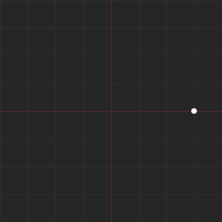
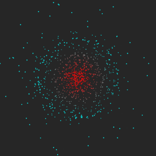

graphical interface to simulate the reaction of particles in a given situations  
intro  : 
  

orbit:  
  

trail: 
  

Equilibrum:  

  

+-----------------------+--------------------------------------------+
|  ``space`` + ``LMB``  |  move view                                 |
+-----------------------+--------------------------------------------+
|  ``space`` + ``RMB``  |  zoom view                                 |
+-----------------------+--------------------------------------------+
|  ``d``                |  change the display mode of the particles  |
+-----------------------+--------------------------------------------+
|  ``f``                |  fit the view to the scene                 |
+-----------------------+--------------------------------------------+
|  ``g``                |  show/hide the grid                        |
+-----------------------+--------------------------------------------+
|  ``r``                |  reset the view                            |
+-----------------------+--------------------------------------------+

